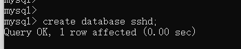

<H1> SSH框架 </H1>

# SSH框架使用

## 测试

**需创建测试库**

注意不管是oracle还是mysql数据库需先创建数据库，hibernate.hbm2ddl.auto配置为create表会根据实体表自动创建但是库需要先创建
```sql
create database sshd;
```



**resources配置调整**

发布到 github 需要注释到 pom 文件中build > resources 中配置，如测试则需要此配置不然resources 中 spring 配置文件无法打包到classes中

执行测试可以执行SpringTest.testSave

## Maven依赖添加
Maven的pom文件添加

properties标签添加版本信息：
```xml
<sinobest.framework.version>1.0.0</sinobest.framework.version>
```

repositories标签中添加私有库
```xml
<!-- liulv的GitHub版本库 -->
<repository>
    <id>maven-repo-master</id>
    <url>https://raw.githubusercontent.com/v4liulv/maven-repo/master</url>
    <releases>
        <enabled>true</enabled>
    </releases>
    <snapshots>
        <enabled>true</enabled>
    </snapshots>
</repository>
```

dependencies标签添加framework-ssh依赖
```xml
        <!-- framework-ssh -->
        <dependency>
            <groupId>com.sinobest</groupId>
            <artifactId>framework-ssh</artifactId>
            <version>${sinobest.framework.version}</version>
        </dependency>
```

## resources构建配置文件
config.properties、spring.xml、spring-hibernate.xml、spring-mvc.xml、spring-jdbc-service.xml

## WEB项目添加web.xml模版
```xml
<?xml version="1.0" encoding="UTF-8"?>
<web-app xmlns:xsi="http://www.w3.org/2001/XMLSchema-instance"
         xmlns="http://java.sun.com/xml/ns/javaee"
         xsi:schemaLocation="http://java.sun.com/xml/ns/javaee http://java.sun.com/xml/ns/javaee/web-app_3_0.xsd"
         version="3.0">
    <display-name>demoSpringMvc</display-name>

    <!-- Log4j 日志 需要放在ContextLoaderListener前面-->
    <!-- 需要添加spring-web.jar包，否则用发生错误信息 -->
    <listener>
        <!-- Spring 5.x已经废除了此方法，使用log4g2代替 -->
        <!--<listener-class>org.springframework.web.util.Log4jConfigListener</listener-class>-->
        <listener-class>org.apache.logging.log4j.web.Log4jServletContextListener</listener-class>
    </listener>
    <filter>
        <filter-name>log4jServletFilter</filter-name>
        <filter-class>org.apache.logging.log4j.web.Log4jServletFilter</filter-class>
    </filter>
    <filter-mapping>
        <filter-name>log4jServletFilter</filter-name>
        <url-pattern>/*</url-pattern>
        <dispatcher>REQUEST</dispatcher>
        <dispatcher>FORWARD</dispatcher>
        <dispatcher>INCLUDE</dispatcher>
        <dispatcher>ERROR</dispatcher>
    </filter-mapping>
    <!-- log4j2-end -->

    <!-- 防止内存泄露 -->
    <listener>
        <listener-class>org.springframework.web.util.IntrospectorCleanupListener</listener-class>
    </listener>
    <!-- Spring配置 监听-->
    <listener>
        <listener-class>org.springframework.web.context.ContextLoaderListener</listener-class>
    </listener>

    <!-- 指定监听器加载的log4j配置文件 -->
    <context-param>
        <param-name>log4j</param-name>
        <param-value>classpath:log4j2.xml</param-value>
    </context-param>
    <context-param>
        <param-name>log4jRefreshInterval</param-name>
        <param-value>6000</param-value>
    </context-param>

    <!-- JX-WS 用于配置地址栏请求路径 -->
    <servlet>
        <servlet-name>JaxWsServlet</servlet-name>
        <servlet-class>com.sun.xml.ws.transport.http.servlet.WSSpringServlet</servlet-class>
    </servlet>
    <servlet-mapping>
        <servlet-name>JaxWsServlet</servlet-name>
        <url-pattern>/services/*</url-pattern>
    </servlet-mapping>

    <!-- spring hibernate -->
    <context-param>
        <param-name>contextConfigLocation</param-name>
        <param-value>classpath:ssh/spring.xml,classpath:ssh/spring-hibernate.xml</param-value>
    </context-param>
    <!-- openSessionInView配置 -->
    <filter>
        <filter-name>openSessionInViewFilter</filter-name>
        <filter-class>org.springframework.orm.hibernate5.support.OpenSessionInViewFilter</filter-class>
        <init-param>
            <param-name>singleSession</param-name>
            <param-value>true</param-value>
        </init-param>
    </filter>
    <filter-mapping>
        <filter-name>openSessionInViewFilter</filter-name>
        <url-pattern>*.hib</url-pattern>
    </filter-mapping>
    <!--spring mvc 配置 -->
    <servlet>
        <servlet-name>springMVC</servlet-name>
        <servlet-class>org.springframework.web.servlet.DispatcherServlet</servlet-class>
        <init-param>
            <param-name>contextConfigLocation</param-name>
            <param-value>classpath:ssh/spring-mvc.xml</param-value>
        </init-param>
        <load-on-startup>1</load-on-startup>
    </servlet>
    <!-- 主要不能直接配置/, 全部进入到spring mvc的过滤，全部都当着请求来处理,需要在spring mvc进行静态资源过滤，才可以不扫描静态资源可以访问静态资源 -->
    <servlet-mapping>
        <servlet-name>springMVC</servlet-name>
        <url-pattern>/</url-pattern>
    </servlet-mapping>

    <!-- encodeing 字符集过滤器，对request和response中的字符编码 -->
    <filter>
        <filter-name>encodingFilter</filter-name>
        <filter-class>org.springframework.web.filter.CharacterEncodingFilter</filter-class>
        <init-param>
            <param-name>encoding</param-name>
            <param-value>UTF-8</param-value>
        </init-param>
        <init-param>
            <param-name>forceEncoding</param-name>
            <param-value>true</param-value>
        </init-param>
    </filter>

    <filter-mapping>
        <filter-name>encodingFilter</filter-name>
        <url-pattern>/*</url-pattern>
    </filter-mapping>

    <error-page>
        <error-code>404</error-code>
        <location>/web/404</location>
    </error-page>

    <welcome-file-list>
        <welcome-file>/index.jsp</welcome-file>
    </welcome-file-list>
</web-app>
```

## MVC框架使用

1.根据数据库表生成实体类，如SshTest

2.DAO层

创建接口TestDao继承BaseDao<SshTest>
```java
public interface TestDao extends BaseDao<SshTest> {
}
```
DAO实现类TestDaoImpl继承BaseDaoImpl<SshTest>，并实现TestDao,事务开启和

```java
@Transactional(value = "transactionManagerOracle")
@Repository(value = "testDao")
public class TestDaoImpl extends BaseDaoImpl<SshTest> implements TestDao{
}
```
3.service业务层
创建业务层接口TestService继承BaseService<SshTest>
```java
public interface TestService extends BaseService<SshTest> {
}
```
创建业务层实现类继承BaseServiceImpl<SshTest>,并实现TestService

```java
@Service("testService")
public class TestServiceImpl extends BaseServiceImpl<SshTest> implements TestService {
    @Qualifier("testDao")
    @Autowired
    private TestDao testDao;

    @Override
    public List<SshTest> getAllEntity(String tableName)
    {
        return testDao.getAllEntity(tableName);
    }
}
```

4.控制器
```java
@Controller
@RequestMapping("/test/")
public class TestController {
   @Resource(name="testService")
   private TestService<SshTest> testService;

    @RequestMapping("adds")
    public String toAddUser(List<SshTest> tests){
        SshTest test = new SshTest();
        test.setName("liulv");
		tests.add(test);
		testService.save(tests);
		return "test";
	}
}
```
跳转到test.jsp


# SSH框架介绍

这样的SSH代表Spring + Sparing MVC + Hibernate.

## SSH版本信息

| 组件  | 版本号  |
| ------------ | ------------ |
| Spring  | 5.0.2.RELEASE  |
| Sparing MVC  | 5.0.2.RELEASE  |
| Hibernate  | 5.2.11.Final  |

## SSH基础核心类
**基础实体类** ： com.sinobest.framework.base.domain.BaseEntity

@MappedSuperclass注解不是一个完整的实体类，他将不会映射到数据库表，但是他的属性都将映射到其子类的数据库字段中。
包含映射字段

| 字段名  | 字段中文名  | 字段类型  | Hib中类型  | 默认值  |
| ------------ | ------------ | ------------ | ------------ |
| SYSTEMID  | 系统主键  | VARCHAR2(32)  | String  | uuid  |
| CREATE_USER  | 创建人  | VARCHAR2(50)  | String  | 'SYS'  |
| CREATE_TIME  | 创建时间  | DATE  | LocalDateTime  | SYSDATE  |
| UPDATE_TIME  | 创建时间  | DATE  | LocalDateTime  | SYSDATE  |
| SCBZ  | 删除标准  | NUMBER(2)  | Long  | 0  |

**基础数据库操作接口和类：**
接口：com.sinobest.framework.base.dao.BaseDao
实现类：com.sinobest.framework.base.dao.impl.BaseDaoImpl
使用@Autowired实现依赖注入Session工厂，提供数据增删查改。

注意：spring-hibernate.xml中的事务Session工厂名称必须为：sessionFactoryOracle，这是为了区分neo4j的事务Session工厂。
BaseDaoImpl使用@Transactional(value = "transactionManagerOracle")注解方式开启事务支持。

**基础业务接口和类：**
接口：com.sinobest.framework.base.service.BaseService
实现类：com.sinobest.framework.base.service.impl.BaseServiceImpl

使用@Qualifier("baseDao") @Autowired实现依赖注入BaseDao,提供实体的基础业务增删查改。

## 配置文件

### config.properties配置文件

```properties
#属性文件

#Oracle 的配置
#hibernate.dialect=org.hibernate.dialect.OracleDialect
#driverClassName=oracle.jdbc.driver.OracleDriver
#validationQuery=SELECT 1 FROM DUAL
#jdbc_url=jdbc:oracle:thin:@localhost:1521:orcl
#jdbc_username=
#jdbc_password=

#SQLServer 的配置
#hibernate.dialect=org.hibernate.dialect.SQLServerDialect
#driverClassName=net.sourceforge.jtds.jdbc.Driver
#validationQuery=SELECT 1
#jdbc_url=jdbc:jtds:sqlserver://127.0.0.1:1433/sy
#jdbc_username=
#jdbc_password=

#Derby 的配置
#hibernate.dialect=org.hibernate.dialect.DerbyDialect
#driverClassName=org.apache.derby.jdbc.EmbeddedDriver
#validationQuery=SELECT 1
#jdbc_url=jdbc:derby:sy;create=true
#jdbc_username=
#jdbc_password=

#MySQL 的配置
#hibernate.dialect=org.hibernate.dialect.MySQLDialect
#driverClassName=com.mysql.jdbc.Driver
#validationQuery=SELECT 1
#jdbc_url=jdbc:mysql://localhost:3306/sshf?useUnicode=true&characterEncoding=utf-8
#jdbc_username=orcl
#jdbc_password=

#oracle 的配置
hibernate.dialect=org.hibernate.dialect.Oracle12cDialect
driver_class_name=oracle.jdbc.driver.OracleDriver
validationQuery=SELECT 1 FROM DUAL
jdbc_url=jdbc:oracle:thin:@//192.168.1.110:1521/orcl
jdbc_username=YY_GXKSH_ZSB
jdbc_password=123456

#其实这个参数的作用主要用于：自动创建|更新|验证数据库表结构。
# validate加载hibernate时，验证创建数据库表结构,
# create 每次加载hibernate，重新创建数据库表结构
# create-drop 加载hibernate时创建，退出是删除表结构
# update 加载hibernate自动更新数据库结构
hibernate.hbm2ddl.auto=none
connection.autocommit=true
hibernate.show_sql=true
hibernate.format_sql=false

sessionInfoName=sessionInfo

uploadFieldName=filedata
uploadFileMaxSize=20971520
uploadFileExts=txt,rar,zip,doc,docx,xls,xlsx,jpg,jpeg,gif,png,swf,wmv,avi,wma,mp3,mid
uploadDirectory=attached
```

### spring.xml配置文件
```xml
<?xml version="1.0" encoding="UTF-8"?>
<!--suppress SpringModelInspection -->
<beans xmlns="http://www.springframework.org/schema/beans"
       xmlns:xsi="http://www.w3.org/2001/XMLSchema-instance"
       xmlns:context="http://www.springframework.org/schema/context"
       xmlns:ws="http://jax-ws.dev.java.net/spring/core"
       xmlns:wss="http://jax-ws.dev.java.net/spring/servlet"
       xsi:schemaLocation="http://www.springframework.org/schema/beans
                            http://www.springframework.org/schema/beans/spring-beans-4.2.xsd
                            http://www.springframework.org/schema/context
                            http://www.springframework.org/schema/context/spring-context-4.2.xsd
                            http://jax-ws.dev.java.net/spring/core
                            http://jax-ws.dev.java.net/spring/core.xsd
                            http://jax-ws.dev.java.net/spring/servlet
                            http://jax-ws.dev.java.net/spring/servlet.xsd">

    <!-- 引入属性文件 -->
    <context:property-placeholder location="classpath:config.properties" />

    <!-- 自动扫描dao和service包(自动注入) -->
    <context:component-scan base-package="
    com.sinobest.*.*.dao,
    com.sinobest.*.*.service,
    com.sinobest.*.*.mvc.dao,
    com.sinobest.*.*.mvc.service" />

     <!-- spring JAX-WS  发布webservice -->
    <!-- 这种集成方式所发布的WebService是一种独立的WebService -->
    <context:component-scan base-package="com.sinobest.framework.webservice.servers" />
    <!-- test com.sinobest.framework.webservice -->
    <wss:binding url="/services/test" >
        <wss:service>
            <ws:service bean="#exampleService" />
        </wss:service>
    </wss:binding>
```

### spring-hibernate.xml配置文件
```xml
<?xml version="1.0" encoding="UTF-8"?>
<beans xmlns="http://www.springframework.org/schema/beans"
       xmlns:xsi="http://www.w3.org/2001/XMLSchema-instance"
       xmlns:tx="http://www.springframework.org/schema/tx"
       xmlns:aop="http://www.springframework.org/schema/aop"
       xsi:schemaLocation="http://www.springframework.org/schema/beans
                            http://www.springframework.org/schema/beans/spring-beans-4.2.xsd
                            http://www.springframework.org/schema/tx
                            http://www.springframework.org/schema/tx/spring-tx-4.2.xsd
                            http://www.springframework.org/schema/aop
                            http://www.springframework.org/schema/aop/spring-aop-4.2.xsd">

<!-- JNDI(通过Tomcat、Weblogic)方式配置数据源 -->
    <!-- <bean id="dataSource" class="org.springframework.jndi.JndiObjectFactoryBean">
          <property name="jndiName" value="${jndiName}"></property>
    </bean> -->

<!--配置数据源-本地化配置方式，不能走数据中间件的方式 -->
    <!-- destroy-method=”close”的作用就是当数据库连接不使用的时候,就把该连接重新放到数据池中,方便下次使用调用.很关键的一个元素。 -->
    <bean name="dataSource" class="com.mchange.v2.c3p0.ComboPooledDataSource" destroy-method="close">
        <property name="jdbcUrl" value="${jdbc_url}" />
        <property name="user" value="${jdbc_username}" />
        <property name="password" value="${jdbc_password}" />
        <property name="driverClass" value="${driver_class_name}" />
        <property name="initialPoolSize" value="1" /> <!-- 初始化连接大小 -->
        <property name="maxPoolSize" value="20" /><!-- 连接池最大使用连接数量 -->
        <property name="idleConnectionTestPeriod" value="20" /><!-- 连接池最大空闲 -->
        <property name="minPoolSize" value="10" /> <!-- 连接池最小空闲 -->
        <property name="checkoutTimeout" value="1000" /><!-- 获取连接最大等待时间 -->
        <property name="acquireIncrement" value="3"/>
        <property name="acquireRetryAttempts" value="30"/>
        <property name="automaticTestTable" value="dual" />
        <property name="breakAfterAcquireFailure" value="false" />
        <property name="autoCommitOnClose" value="true" />
        <property name="testConnectionOnCheckin" value="true" />
        <property name="acquireRetryDelay" value="1000" /><!-- 配置间隔多久才进行一次检测，检测需要关闭的空闲连接，单位是毫秒 -->
        <property name="maxIdleTime" value="60" />  <!-- 配置一个连接在池中最小生存的时间，单位是毫秒 -->
    </bean>

<!--jdbcService服务对象-->
    <bean id="appJdbcService" class="com.sinobest.framework.utils.JdbcService">
        <property name="dataSource" ref="dataSource" />
        <property name="lobHandler" ref="appDefLobHandler" />
    </bean>

<!-- 大对象处理器  -->
    <bean id="appDefLobHandler" class="org.springframework.jdbc.support.lob.DefaultLobHandler" />

<bean id="sessionFactoryOracle" class="org.springframework.orm.hibernate5.LocalSessionFactoryBean">
        <property name="dataSource" ref="dataSource" />
        <property name="hibernateProperties">
            <props>
                <prop key="hibernate.hbm2ddl.auto">${hibernate.hbm2ddl.auto}</prop>
                <prop key="hibernate.dialect">${hibernate.dialect}</prop>
                <prop key="connection.autocommit">${connection.autocommit}</prop>
                <prop key="hibernate.show_sql">${hibernate.show_sql}</prop>
                <prop key="hibernate.format_sql">${hibernate.format_sql}</prop>
                <prop key="hibernate.connection.url">${jdbc_url}</prop>
                <prop key="hibernate.connection.driver_class">${driver_class_name}</prop>
            </props>
        </property>
        <property name="packagesToScan"> <!--自动扫描注解方式配置的hibernate类文件-->
            <list>
                <!-- 字典 -->
                <value>com.sinobest.framework.dictionaries.mvc.domain</value>
                <!-- mvctest -->
                <value>com.sinobest.framework.test.mvc.domain</value>
            </list>
        </property>
    </bean>

    <!-- 配置Hibernate事务管理器 命名为 transactionManagerOracle 是为了区分spring-neo4j的或者其他数据库的事务注解 > -->
    <bean id="transactionManagerOracle" class="org.springframework.orm.hibernate5.HibernateTransactionManager">
        <property name="sessionFactory" ref="sessionFactoryOracle" />
    </bean>

    <!-- 配置事务异常封装 -->
    <bean id="persistenceExceptionTranslationPostProcessor"
          class="org.springframework.dao.annotation.PersistenceExceptionTranslationPostProcessor" />

    <!-- 开启事务方式一： 注解方式配置事务， 支持事务注解的(@Transactional)， 推荐方式-->
    <tx:annotation-driven transaction-manager="transactionManagerOracle" />

</beans>
```
### spring-mvc.xml配置文件

```xml
<?xml version="1.0" encoding="UTF-8"?>
<beans xmlns="http://www.springframework.org/schema/beans"
       xmlns:context="http://www.springframework.org/schema/context"
       xmlns:p="http://www.springframework.org/schema/p"
       xmlns:mvc="http://www.springframework.org/schema/mvc"
       xmlns:xsi="http://www.w3.org/2001/XMLSchema-instance"
       xsi:schemaLocation="http://www.springframework.org/schema/beans
      http://www.springframework.org/schema/beans/spring-beans-4.2.xsd
      http://www.springframework.org/schema/context
      http://www.springframework.org/schema/context/spring-context-4.2.xsd
      http://www.springframework.org/schema/mvc
      http://www.springframework.org/schema/mvc/spring-mvc-4.2.xsd">

    <!-- 注解扫描包 -->
    <!-- 扫描web包，应用Spring的注解 @Controller -->
    <context:component-scan base-package="com.sinobest.*.*.web" />
    <context:component-scan base-package="com.sinobest.*.*.controller" />

    <!-- 开启mvc注解 -->
    <mvc:annotation-driven />

    <!-- 静态资源不进行mvc扫描 -->
    <mvc:resources location="/assets/" mapping="/assets/**"/>
    <mvc:resources location="/css/" mapping="/css/**"/>
    <mvc:resources location="/js/" mapping="/js/**"/>
    <mvc:resources location="/fonts/" mapping="/fonts/**"/>
    <mvc:resources location="/images/" mapping="/images/**"/>
    <mvc:resources location="/data/" mapping="/data/**"/>
    <mvc:resources location="/html/" mapping="/html/**"/>
    <mvc:resources location="/ws/" mapping="/ws/**"/>

    <!-- 视图解析器 -->
    <bean id="viewResolver"
          class="org.springframework.web.servlet.view.InternalResourceViewResolver">
        <property name="prefix" value="/views/jsp/"/>
        <property name="suffix" value=".jsp"/>
    </bean>

    <!-- 显然是控制文件上传的 -->
    <bean id="multipartResolver"
          class="org.springframework.web.multipart.commons.CommonsMultipartResolver" p:defaultEncoding="UTF-8">
        <property name="maxUploadSize" value="1024000000"/>
    </bean>
</beans>
```

### spring-jdbc-service.xml配置文件
```xml
<?xml version="1.0" encoding="UTF-8"?>
<beans xmlns="http://www.springframework.org/schema/beans"
       xmlns:xsi="http://www.w3.org/2001/XMLSchema-instance"
       xmlns:context="http://www.springframework.org/schema/context"
       xmlns:tx="http://www.springframework.org/schema/tx"
       xmlns:aop="http://www.springframework.org/schema/aop"
       xsi:schemaLocation="http://www.springframework.org/schema/beans
                            http://www.springframework.org/schema/beans/spring-beans-4.2.xsd
                            http://www.springframework.org/schema/context
                            http://www.springframework.org/schema/context/spring-context-4.2.xsd
                            http://jax-ws.dev.java.net/spring/core
                            http://jax-ws.dev.java.net/spring/core.xsd
                            http://jax-ws.dev.java.net/spring/servlet
                            http://jax-ws.dev.java.net/spring/servlet.xsd
                            http://www.springframework.org/schema/tx
                            http://www.springframework.org/schema/aop">

    <!-- 引入属性文件 -->
    <context:property-placeholder location="classpath:config.properties" />

    <!--配置数据源-本地化配置方式，不能走数据中间件的方式 -->
    <!-- destroy-method=”close”的作用就是当数据库连接不使用的时候,就把该连接重新放到数据池中,方便下次使用调用.很关键的一个元素。 -->
    <bean name="dataSource" class="com.mchange.v2.c3p0.ComboPooledDataSource" destroy-method="close">
        <property name="jdbcUrl" value="${jdbc_url}" />
        <property name="user" value="${jdbc_username}" />
        <property name="password" value="${jdbc_password}" />
        <property name="driverClass" value="${driver_class_name}" />
        <property name="initialPoolSize" value="1" /> <!-- 初始化连接大小 -->
        <property name="maxPoolSize" value="20" /><!-- 连接池最大使用连接数量 -->
        <property name="idleConnectionTestPeriod" value="20" /><!-- 连接池最大空闲 -->
        <property name="minPoolSize" value="10" /> <!-- 连接池最小空闲 -->
        <property name="checkoutTimeout" value="1000" /><!-- 获取连接最大等待时间 -->
        <property name="acquireIncrement" value="3"/>
        <property name="acquireRetryAttempts" value="30"/>
        <property name="automaticTestTable" value="dual" />
        <property name="breakAfterAcquireFailure" value="false" />
        <property name="autoCommitOnClose" value="true" />
        <property name="testConnectionOnCheckin" value="true" />
        <property name="acquireRetryDelay" value="1000" /><!-- 配置间隔多久才进行一次检测，检测需要关闭的空闲连接，单位是毫秒 -->
        <property name="maxIdleTime" value="60" />  <!-- 配置一个连接在池中最小生存的时间，单位是毫秒 -->
    </bean>

    <!--jdbcService服务对象-->
    <bean id="appJdbcService" class="com.sinobest.framework.utils.JdbcService">
        <property name="dataSource" ref="dataSource" />
        <property name="lobHandler" ref="appDefLobHandler" />
    </bean>

    <!-- 大对象处理器  -->
    <bean id="appDefLobHandler" class="org.springframework.jdbc.support.lob.DefaultLobHandler" />
</beans>
```